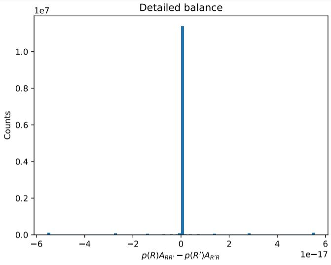
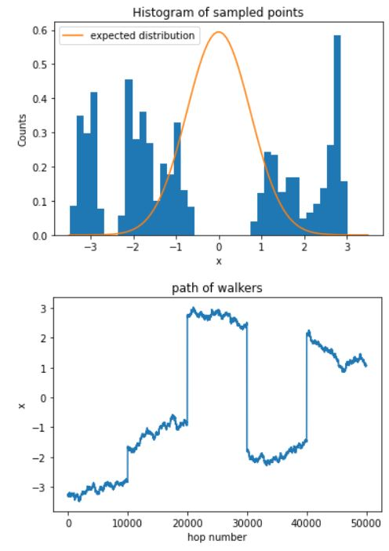

# Weekly progress journal

## Instructions

In this journal you will document your progress of the project, making use of weekly milestones. In contrast to project 1, you will need to define yourself detailed milestones.

Every week you should 

1. define **on Wednesday** detailed milestones for the week (according to the
   high-level milestones listed in the review issue).
   Then make a short plan of how you want to 
   reach these milestones. Think about how to distribute work in the group, 
   what pieces of code functionality need to be implemented. 
2. write about your progress **before** the Tuesday in the next week with
   respect to the milestones. Substantiate your progress with links to code,
   pictures or test results. Reflect on the relation to your original plan.

Note that there is a break before the deadline of the first week review
issue. Hence the definition of milestones and the plan for week 1 should be
done on or before 15 April.

We will give feedback on your progress on Tuesday before the following lecture. Consult the 
[grading scheme](https://computationalphysics.quantumtinkerer.tudelft.nl/proj2-grading/) 
for details how the journal enters your grade.

Note that the file format of the journal is *markdown*. This is a flexible and easy method of 
converting text to HTML. 
Documentation of the syntax of markdown can be found 
[here](https://docs.gitlab.com/ee/user/markdown.html#gfm-extends-standard-markdown). 
You will find how to include [links](https://docs.gitlab.com/ee/user/markdown.html#links) and 
[images](https://docs.gitlab.com/ee/user/markdown.html#images) particularly
useful.

## Week 1
Made a function capable of sampling following a markov chain [mcmc_sample](https://gitlab.kwant-project.org/computational_physics/projects/Project-2---QMC_pdedalmauhugue/-/blob/master/Skeleton.py#L23). Computed energies for the harmonic oscillator (see Fig. 1 below) and Jos Thijssen's book ([chapter 12.2.2](Figures/table with energies.JPG)). The computations are quite slow (few minutes) samples as large as the literature's are taken (~ 15_000_000, literature uses 400*30_000 = 12_000_000, about the same...). It might be possible to remove for-loops in the mcmc_sample function. Condition for detailed balance in our code is met and is calculated [here](https://gitlab.kwant-project.org/computational_physics/projects/Project-2---QMC_pdedalmauhugue/-/blob/master/Skeleton.py#L50-53) and plotted in figure 2. In the figure we show a histogram of the difference $`A_{R' R}p(R') - A_{R' R}p(R')`$. As expected, this difference is zero within python's rounding error (1e-17).

Fig. 1: Harmonic oscillator energies.

Fig. 2: Histogram of $`A_{R' R}p(R') - A_{R' R}p(R')`$.

(due before 21 April)

## Week 2
(due before 28 April)

Milestones:

    - Pol: modify code to have a desired number of walkers each taking a desired number of hops.
    - Matteo: Include error of the mean calculation from previous project.
    - Alberto: Change code to sample functions of more than one variable.

Once the above is done, Hydrogen atom integrals will become possible to compute. Later, we will simply extend the number of variables from three (3D hydrogen) to six (two particles with three coordinates each in He atom). Also, we will need to implement proper minimization.

In figure 3 one can clearly see that each walker is a separate and independent object. A small hop size is used, otherwise it is too hard to discern each walker's path. What still needs to be added is a way to remove the first few steps (~3000) of each walker in order to ensure that each walker is at equilibrium.

Fig. 3: 5 walkers with hop size = 0.01.

All the milestones have been achieved. As shown above, we can have a desired amount of walkers each taking a desired amount of hops. Also, we implemented a function that computes the error and we can sample functions in 3D (specifically, an hydrogen atom). The results for the hydrogen atom are convincing. Figure 4 below shows the histogram of the sampled distribution and the expected plot for the hydrogen atom. The two overlap, demonstrating that the simulation works correctly. Also, the results for energy given by the [Integrate_3D](https://gitlab.kwant-project.org/computational_physics/projects/Project-2---QMC_pdedalmauhugue/-/blob/master/Skeleton.py#L195-215) function are in accordance with the data present in the table from the book "Computational physics" by Jos Thijssen.

Fig. 4: Histogram of sampled points for an Hydrogen atom and the expected distribution

## Week 3
(due before 5 May)

